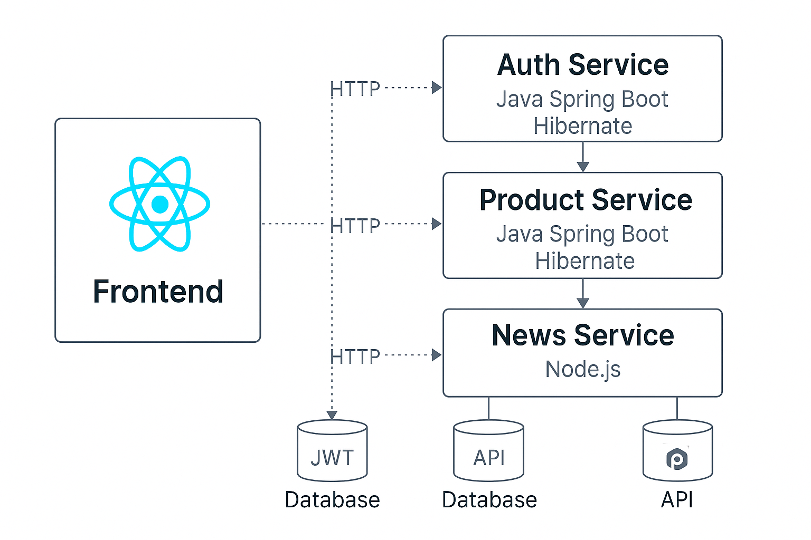
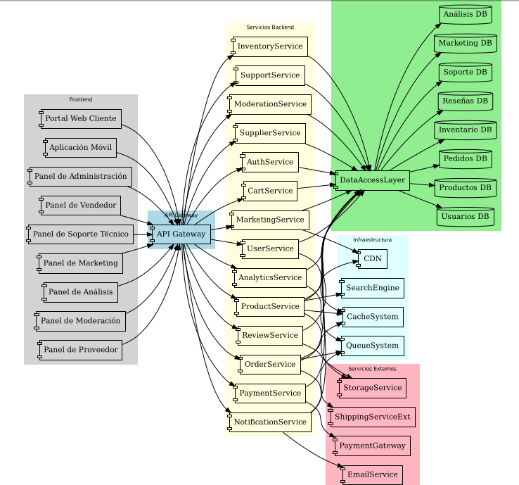
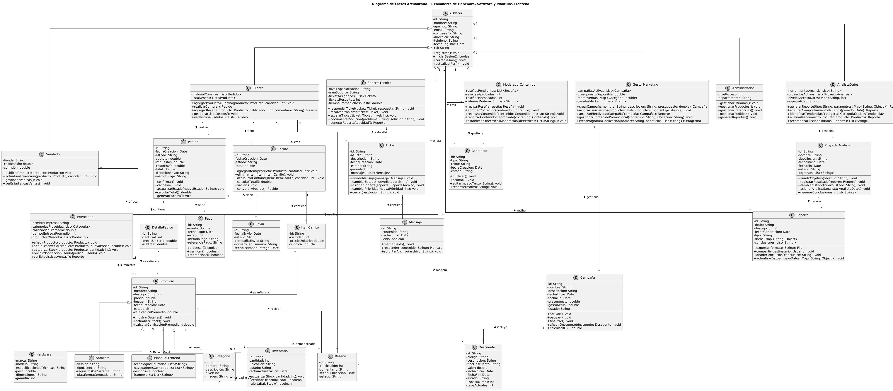
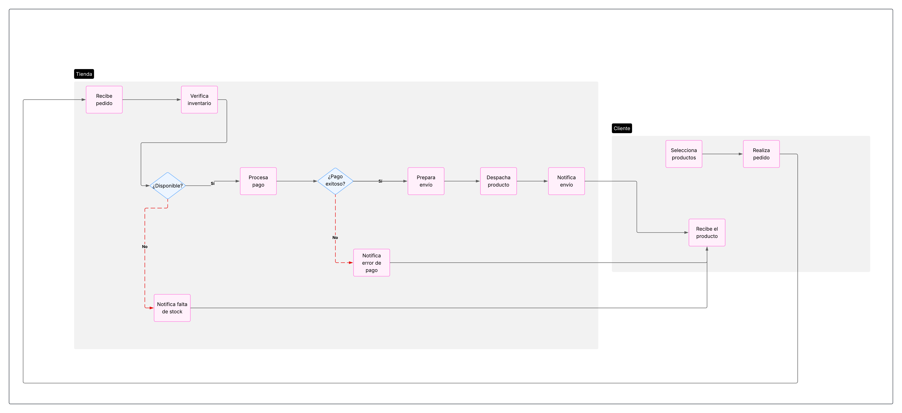

# 🛒 PandoraTech | Sistema de Comercio Electrónico Full-Stack


Proyecto de ecommerce que ofrece productos de hardware, software y plantillas frontend. Utiliza un enfoque **modular con microservicios** para mantener la escalabilidad y separación de responsabilidades. El sistema cuenta con un frontend moderno en React y tres microservicios backend: autenticación, gestión de productos y noticias.

---

## ⚙️ Tecnologías Utilizadas

### 🧭 Frontend
- React + Vite
- TailwindCSS
- Fetch
- React Router DOM

### 🔧 Microservicios Backend

| Microservicio        | Tecnología         | Funcionalidad                          |
|----------------------|--------------------|----------------------------------------|
| Auth Service         | Java + Spring Boot | Registro, login, generación de JWT     |
| productos-api        | Java + Spring Boot | CRUD de productos, Hibernate + SQLite  |
| News Service         | Node.js + Express  | Consulta de noticias públicas (API)    |

### 🧪 Herramientas
- Postman (para pruebas)
- DB Browser for SQLite (visualización BD)
- Tomcat embebido (Spring Boot)
- Hibernate ORM

---

### 🧩 Diagramas del Sistema

### 🛠️ Arquitectura de Microservicios del Backend

A continuación se presenta un diagrama de la arquitectura Backend, que representa cómo interactúan el frontend y los microservicios:

<p align="center">
  
</p>

### 🧱 Diagrama de Componentes

<p align="center">
  
</p>

### 🧩 Diagrama de Clases

<p align="center">
  
</p>

### 📊 Diagrama BPMN

<p align="center">
  
</p>


### 🔒 Funcionalidades

### Usuario Final
- Registro y login (con JWT)
- Visualización de productos por categoría
- Búsqueda y filtrado de productos
- Visualización de noticias del sector tecnológico
- Carrito de compras (en desarrollo)
- Checkout (en desarrollo)

### Administrador
- Gestión de productos (crear, editar, eliminar)
- Control de acceso por roles
- Panel administrativo básico

---

### 📦 Clonar el Proyecto
```bash
git clone https://github.com/tu-usuario/tu-repo-ecommerce.git](https://github.com/Grupo-4A/E-Commerce-Grupo-4A.git
cd tu-repo-ecommerce
```
### 🖼 Frontend (React + Vite)
```bash
cd frontend
npm install
npm run dev
```
### 🔐 Microservicio de Autenticación (Spring Boot + JWT + MongoDB)
```bash
cd backend/auth-service
./mvnw install
./mvnw spring-boot:run
```
### 🛒 Microservicio de Productos (Sprin Boot + Hibernate + SQLite)
```bash
cd backend/productos-api
./mvnw install
./mvnw spring-boot:run
```
### 📰 Microservicio de Noticias (Node.js + API externa)
```bash
cd backend/news-service
npm install
node server.js
```
